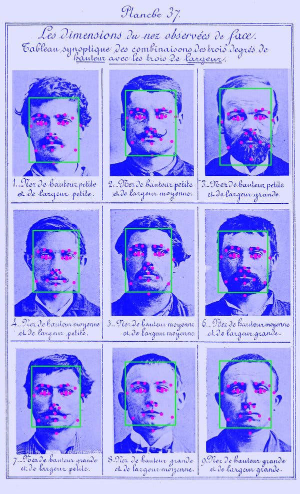
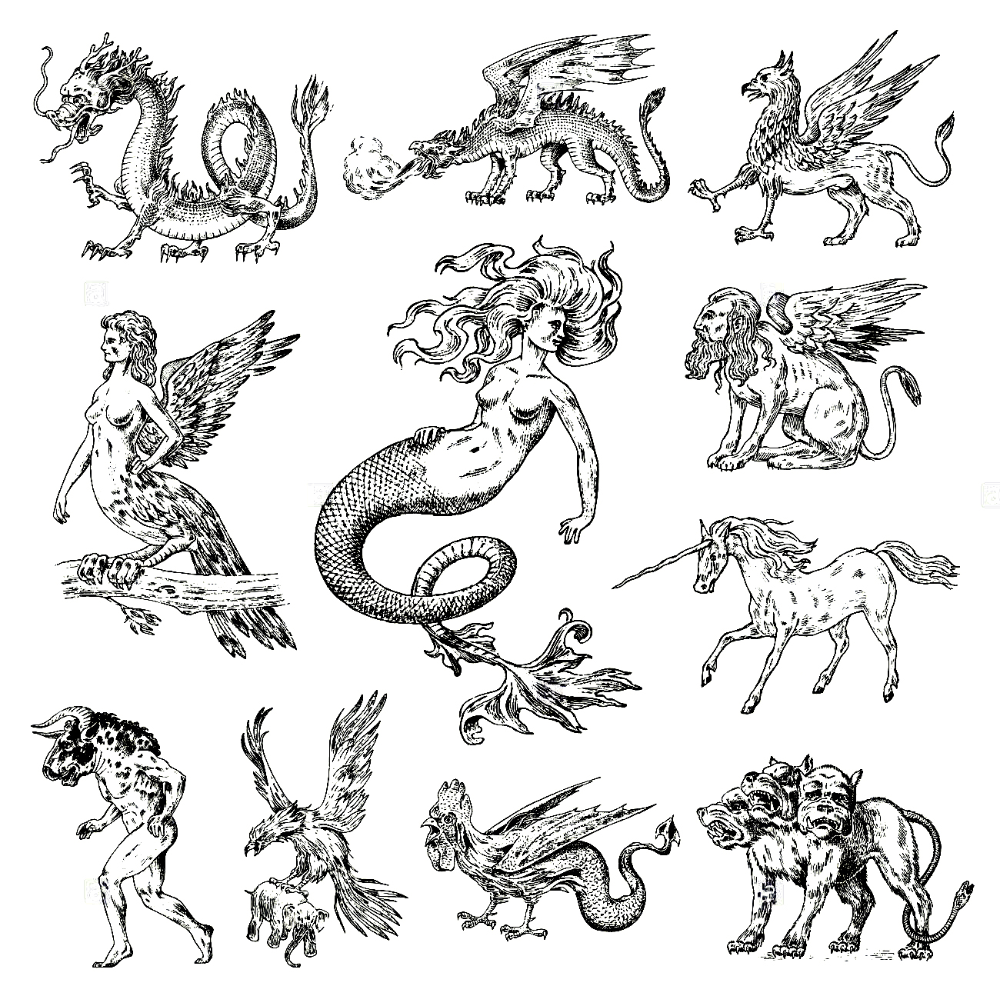

# **Diagnostics of an Idol**

### Table of Contents
1. [Artefact](#artefact)
    1. [Metadata](#metadata)
2. [Research](#research)
3. [Transcoding](#transcoding)
    1. [Transcoding No. 1](#transcoding-no-1)
    2. [Transcoding No. 2](#transcoding-no-2)
    3. [Transcoding Tools](#transcoding-tools)
4. [Reflection](#reflection)
5. [Outcomes](#outcomes)
6. [Conclusion](#conclusion)
7. [Bibliography](#bibliography) 

# **Artefact**

Artist *Mieke Gerritzen* designed this textile piece, called Hero's Scarf, with a pattern created by the repetition of images of all possible modern icons of public figures, such as Mickey Mouse, Nelson Mandela, Marylin Monroe, but also mass murderers like Saddam Hussein, Osama BinLaden and Hitler. The eloquence of the scarf is precisely due to its extensive choice.

## **Metadata**
**Hero's Scarf**
| Tag | Data |  
|--|--|
**IISG Call Number** | [IISG BG P1/713](https://search.iisg.amsterdam/Record/1268178)
| **Physical Description** | Silk Scarf 
| **Type** | Object
| **Medium** | Textile
| **Materials** | Fabric/Silk
| **Date** | 2008
|| This silk scarf is 40x200 cm and fully printed with a colorful pattern created by the repetition of squared images (placed in a dense squared grid) of modern icons of public figures (factual and fictional) such as Madonna, Mickey Mouse, Jesus, Hitler, a burqua and Ilona Staller. 

# **Research**

## *Mieke's Spectacle*

Mieke Gerritzen designed a scarf with the images of all possible modern icons of public figures, such as Mickey Mouse, Nelson Mandela, Marylin Monroe, but also mass murderers like Saddam Hussein, Osama BinLaden and Hitler. The eloquence of the scarf is precisely due to its extensive choice. This scarf was taken from the range on offer in the museum shop of the Stedelijk Museum in Amsterdam because visitors were offended by the presence of mass murderers on the scarf. Mieke Gerritzen discusses the position of 'controversial art' in a museum (shop). Apparently a museum shop is not a real part of the museum but a purely commercial institution. After a few days the scarf was offered for sale again. 
Her work always revolves around exploring the relationship between images and various aspects of contemporary life. Mieke’s work is always thought-provoking and critical towards the way we devour images that are served to us every day of our lives. She often points out the paradox of the abundance of visual material on the one hand, and our illiteracy when it comes to really understanding what we see on the other hand. 
> [...] "Yet the most characteristic quality of this new social development may not be the number of images that confronts us but rather our deep need to visualise everything we deem important. We do this en masse, even though most of us aren’t trained to do so."

[http://heroesmuseum.online/](http://heroesmuseum.online/) → HEROES MUSEUM, where all of the 'Heroes' are linked. 

#### *Iconophilia VS Iconoclasm*
**This is the paradox of iconoclasm: it draws us to the very thing it would destroy, inscribing a story and creating an object that is, in certain respects, richer and more powerful than before.**   The toppled monument and the defaced statue strike us with greater force than their integral counterparts, becoming potential sites of reflection but also of emotional response.
There can be so much connected to this topic: the public perception of a "God", the maniac obsession of celebrities, that become icons (in a capitalistic society), the destruction of global heritage by an elite, the manipulation of information throughout time: the disappearing of some and the transformation of others. 
Sacred damaged images acquire more symbolical value after the iconoclast intervention; other 'icons' simply disappear. 
The personal subjective perception of 'icons'? How do people see people and why?  
Think of this Heroes list's meaning in society, what is the response and what is the interpretation I want to give to it? Can I create my own Heroes' list? Or a list that would function in a utopian parallel universe?

Idolatry's Identity

Idolatry is the worship of an idol or cult image, being a physical image, such as a statue, or a person in place of God. In Abrahamic religions, namely Judaism, Christianity and Islam, idolatry connotes the worship of something or someone other than God as if it were God. In these monotheistic religions, idolatry has been considered as the "worship of false gods" and is forbidden by the values such as the Ten Commandments. Other monotheistic religions may apply similar rules. In many Indian religions, such as theistic and non-theistic forms of Hinduism, Buddhism and Jainism, idols (murti) are considered as symbolism for the absolute but not The Absolute, or icons of spiritual ideas, or the embodiment of the divine. It is a means to focus one's religious pursuits and worship (bhakti). In the traditional religions of ancient Egypt, Greece, Rome, Africa, Asia, the Americas and elsewhere, the reverence of an image or statue has been a common practice, and cult images have carried different meanings and significance. 
	The opposition to the use of any icon or image to represent ideas of reverence or worship is called aniconism. The destruction of idols and images as icons of veneration is called iconoclasm, and this has long been accompanied with violence between religious groups that forbid idol worship and those who have accepted icons, images and idols for worship. 
The definition of idolatry has been a contested topic within Abrahamic religions, with many Muslims and Protestant Christians condemning the Catholic veneration and statues of the Virgin Mary in many churches as a form of idolatry. 
	The history of religions has been marked with accusations and denials of idolatry. These accusations have considered statues and images to be devoid of symbolism. Alternatively, the topic of idolatry has been a source of disagreements between many religions, or within denominations of various religions, with the presumption that icons of one's own religious practices have meaningful symbolism, while another person's different religious practices do not.  
The word idolatry comes from the Greek word eidololatria which itself is a compound of two words: eidolon ("image") and latreia ("worship"). The word eidololatria thus means "worship of idols", which in Latin appears first as idololatria, then in Vulgar Latin as idolatria, therefrom it appears in 12th century Old French as idolatrie, which for the first time in mid 13th century English appears as "idolatry". 
	Although the Greek appears to be a loan translation of the Hebrew phrase avodat elilim, which is attested in rabbinic literature (e.g., bChul., 13b, Bar.), the Greek term itself is not found in the Septuagint, Philo, Josephus, or in other Hellenistic Jewish writings. The original term used in early rabbinic writings is oved avodah zarah (AAZ, worship of avoda zara, or "pagan"), while avodat kochavim umazalot (AKUM, worship of planets and constellations) is not found in its early manuscripts. The later Jews used the term, avodh zereh, meaning "strange worship".
Idolatry has also been called idolism, iconolatry or idolodulia in historic literature. 
The earliest so-called Venus figurines have been dated to the prehistoric Upper Paleolithic era (35 – 40 ka onwards).  Archaeological evidence from the islands of the Aegean Sea have yielded Neolithic era Cycladic figures from 4th and 3rd millennium BC, idols in namaste posture from Indus Valley civilization sites from the 3rd millennium BC, and much older petroglyphs around the world show humans began producing sophisticated images. However, because of a lack of historic texts describing these, it is unclear what, if any connection with religious beliefs, these figures had, or whether they had other meaning and uses, even as toys. 
The earliest historic records confirming cult images are from the ancient Egyptian civilization, thereafter related to the Greek civilization. By the 2nd millennium BC two broad forms of cult image appear, in one images are zoomorphic (god in the image of animal or animal-human fusion) and in another anthropomorphic (god in the image of man). The former is more commonly found in ancient Egypt influenced beliefs, while the anthropomorphic images are more commonly found in Indo-European cultures.Symbols of nature, useful animals or feared animals may also be included by both. The stelae from 4,000 to 2,500 BC period discovered in France, Ireland through Ukraine, and in Central Asia through South Asia, suggest that the ancient anthropomorphic figures included zoomorphic motifs. In Nordic and Indian subcontinent, bovine motifs or statues, for example, were common. In Ireland, iconic images included pigs. 
	The Ancient Egyptian religion was polytheistic, with large cult images that were either animals or included animal parts. Ancient Greek civilization preferred human forms, with idealized proportions, for divine representation. The Canaanites of West Asia incorporated a golden calf in their pantheon. 
	The ancient philosophy and practices of the Greeks, thereafter Romans, were imbued with polytheistic idolatry. They debate what is an image and if the use of image is appropriate. To Plato, images can be a remedy or poison to the human experience. To Aristotle, states Paul Kugler, an image is an appropriate mental intermediary that "bridges between the inner world of the mind and the outer world of material reality", the image is a vehicle between sensation and reason. Idols are useful psychological catalysts, they reflect sense data and pre-existing inner feelings. They are neither the origins nor the destinations of thought but the intermediary in the human inner journey. Fervid opposition to the idolatry of the Greeks and Romans was of Early Christianity and later Islam, as evidenced by the widespread desecration and defacement of ancient Greek and Roman sculptures that have survived into the modern era.

Idolatry in Religion
 

***Idolatry in Judaism*** 
Judaism prohibits any form of idolatry. According to its commandments, neither is worship of foreign gods in any form or through icons allowed, nor is idolatrous worship of the God of Israel permitted. 
	Many Jewish scholars such as Rabbi Saadia Gaon, Rabbi Bahya ibn Paquda, and Rabbi Yehuda Halevi have elaborated on the issues of idolatry. One of the oft-cited discussions is the commentary of Rabbi Moshe ben Maimon (Maimonides) on idolatry. According to the Maimonidean interpretation, idolatry in itself is not a fundamental sin, but the grave sin is the belief that God can be corporeal. In the Jewish belief, the only image of God is man, one who lives and thinks; God has no visible shape, and it is absurd to make or worship images; instead man must worship the invisible God alone. 
	The commandments in the Hebrew Bible against idolatry forbade the practices and gods of ancient Akkad, Mesopotamia, and Egypt. The Hebrew Bible states that God has no shape or form, is utterly incomparable, is everywhere and cannot be represented in a physical form of an idol.  
	Biblical scholars have historically focused on the textual evidence to construct the history of idolatry in Judaism, a scholarship that post-modern scholars have increasingly begun deconstructing. This biblical polemics, states Naomi Janowitz, a professor of Religious Studies, has distorted the reality of Israelite religious practices and the historic use of images in Judaism.  
The direct material evidence is more reliable, such as that from the archaeological sites, and this suggests that the Jewish religious practices have been far more complex than what biblical polemics suggest. Judaism included images and cultic statues in the First Temple period, the Second Temple period, Late Antiquity (2nd to 8th century CE), and thereafter. Nonetheless, these sorts of evidence may be simply descriptive of Ancient Israelite practices in some — possibly deviant — circles, but cannot tell us anything about the mainstream religion of the Bible which proscribes idolatry.  
The history of Jewish religious practice has included cult images and figurines made of ivory, terracotta, faience and seals. As more material evidence emerged, one proposal has been that Judaism oscillated between idolatry and iconoclasm. However, the dating of the objects and texts suggest that the two theologies and liturgical practices existed simultaneously. The claimed rejection of idolatry because of monotheism found in Jewish literature and therefrom in biblical Christian literature, states Janowitz, has been unreal abstraction and flawed construction of the actual history. The material evidence of images, statues and figurines taken together with the textual description of cherub and "wine standing for blood", for example, suggests that symbolism, making religious images, icon and index has been integral part of Judaism. Every religion has some objects that represent the divine and stand for something in the mind of the faithful, and Judaism too has had its holy objects and symbols such as the Menorah.
  
***Idolatry in Christianity*** 
The Christian view of idolatry may generally be divided into two general categories: the Catholic and Eastern Orthodox view which accepts the use of religious images, and the views of many Protestant churches that considerably restrict their use. However, many Protestants have used the image of the cross as a symbol. 
The Roman Catholic and particularly the Orthodox Churches have traditionally defended the use of icons. The debate on what images signify and whether reverence with the help of icons in church is equivalent to idolatry has lasted for many centuries, particularly from the 7th century until the Reformation in the 16th century. These debates have supported the inclusion of icons of Jesus Christ, the Virgin Mary, and the Apostles, the iconography expressed in stained glass, regional saints and other symbols of Christian faith. It has also supported the practices such as the Catholic mass, burning of candles before pictures, Christmas decorations and celebrations, and festive or memorial processions with statues of religious significance to Christianity.  
	St. John of Damascus, in his "On the Divine Image", defended the use of icons and images, in direct response to the Byzantine iconoclasm that began widespread destruction of religious images in the 8th century, with support from emperor Leo III and continued by his successor Constantine V during a period of religious war with the invading Umayyads. John of Damascus wrote, "I venture to draw an image of the invisible God, not as invisible, but as having become visible for our sakes through flesh and blood", adding that images are expressions "for remembrance either of wonder, or an honor, or dishonor, or good, or evil" and that a book is also a written image in another form. He defended the religious use of images based on the Christian doctrine of Jesus as an incarnation. 
	St. John the Evangelist cited John 1:14, stating that "the Word became flesh" indicates that the invisible God became visible, that God's glory manifested in God's one and only Son as Jesus Christ, and therefore God chose to make the invisible into a visible form, the spiritual incarnated into the material form. 
	The early defense of images included exegesis of Old and New Testament. Evidence for the use of religious images is found in Early Christian art and documentary records. For example, the veneration of the tombs and statues of martyrs was common among early Christian communities. In 397 St. Augustine of Hippo, in his Confessions 6.2.2, tells the story of his mother making offerings for the statues and tombs of martyrs. 
	The Catholic defense mentions textual evidence of external acts of honor towards icons, arguing that there are "different kinds of worship" and that the honor shown to icons differs entirely from the adoration of God. Citing the Old Testament, these arguments present examples of forms of "honor" such as in Genesis 33:3, with the argument that "adoration is one thing, and that which is offered in order to honor something of great excellence is another". These arguments assert, "the honor given to the image is transferred to its prototype", and that venerating an image of Christ does not terminate at the image itself — the material of the image is not the object of worship — rather it goes beyond the image, to the prototype.
	According to the Catechism of the Catholic Church, "Idolatry not only refers to false pagan worship.  
Man commits idolatry whenever he honours and reveres a creature in place of God, whether this be gods, or demons (for example satanism), power, pleasure, race, ancestors, the state, money, etc." The manufacture of images of Jesus, the Virgin Mary and Christian saints, along with prayers directed to these has been widespread among the Catholic faithful. 
The Eastern Orthodox Church has differentiated between latria and dulia. A latria is the worship due God, and latria to anyone or anything other than God is doctrinally forbidden by the Orthodox Church; however dulia has been defined as veneration of religious images, statues or icons which is not only allowed but obligatory. This distinction was discussed by Thomas Acquinas in section 3.25 of Summa Theologiae. 
In Orthodox apologetic literature, the proper and improper use of images is extensively discussed. Exegetical orthodox literature points to icons and the manufacture by Moses (under God's commandment) of the Bronze Snake in Numbers 21:9, which had the grace and power of God to heal those bitten by real snakes. Similarly, the Ark of the Covenant was cited as evidence of the ritual object above which Yahweh was present. 
	Veneration of icons through proskynesis was codified in 787 AD by the Seventh Ecumenical Council. This was triggered by the Byzantine Iconoclasm controversy that followed raging Christian-Muslim wars and a period of iconoclasm in West Asia. The defense of images and the role of the Syrian scholar John of Damascus was pivotal during this period. The Eastern Orthodox church has ever since celebrated the use of icons and images. 
The idolatry debate has been one of the defining differences between Papal Catholicism and Anti-papal Protestantism. The anti-papal writers have prominently questioned the worship practices and images supported by Catholics, with many Protestant scholars listing it as the "one religious error larger than all others". The sub-list of erring practices have included among other things the veneration of Virgin Mary, the Catholic mass, the invocation of saints, and the reverence expected for and expressed to Pope himself. The charges of supposed idolatry against the Roman Catholics were leveled by a diverse group of Protestants, from the Church of England to John Calvin in Geneva. 
	Protestants did not abandon all icons and symbols of Christianity. They typically avoid the use of images, except the cross, in any context suggestive of veneration. The cross remained their central icon. Technically both major branches of Christianity have had their icons, states Carlos Eire, a professor of religious studies and history, but its meaning has been different to each and "one man's devotion was another man's idolatry".  
This was particularly true not only in the intra-Christian debate, states Eire, but also when soldiers of Catholic kings replaced "horrible Aztec idols" in the American colonies with "beautiful crosses and images of Mary 
and the saints". 
	Protestants often accuse Catholics of idolatry, iconolatry, and even paganism; in the Protestant Reformation such language was common to all Protestants. In some cases, such as the Puritan groups denounced all forms of religious objects, whether in three-dimensional or two-dimensional form, including the Christian cross. 
	The body of Christ on the cross is an ancient symbol used within the Catholic, Eastern Orthodox, Anglican, and Lutheran churches, in contrast with some Protestant groups, which use only a simple cross. In Judaism, the reverence to the icon of Christ in the form of cross has been seen as idolatry. However, some Jewish scholars disagree and consider Christianity to be based on Jewish belief and not truly idolatrous.
  
***Idolatry in Islam*** 
In Islamic sources, the concept of shirk (sh-r-k) can refer to "idolatry", though it is most widely used to denote "association of partners with God". The concept of Kufr (k-f-r) can also include idolatry (among other forms of disbelief). The one who practices shirk is called mushrik (plural mushrikun) in the Islamic scriptures. The Quran forbids idolatry. Over 500 mentions of kufr and shirk are found in the Quran, and both concepts are strongly forbidden Shia classical theology differs in the concept of Shirk. According to Twelver theologians, the attributes and names of God have no independent and hypostatic existence apart from the being and essence of God. Any suggestion of these attributes and names being conceived of as separate is thought to entail polytheism. It would be even incorrect to say God knows by his knowledge which is in his essence but God knows by his knowledge which is his essence. Also God has no physical form and he is insensible. The border between theoretical Tawhid and Shirk is to know that every reality and being in its essence, attributes and action are from him (from Him-ness), it is Tawhid. Every supernatural action of the prophets is by God's permission as Quran points to it. The border between the Tawhid and Shirk in practice is to assume something as an end in itself, independent from God, not as a road to God (to Him-ness). Ismailis go deeper into the definition of Shirk, declaring they don't recognize any sort of ground of being by the esoteric potential to have intuitive knowledge of the human being. 
	Islam strongly prohibits all form of idolatry, which is part of the sin of shirk with the general meaning of "to share". In the context of the Qur'an, the particular sense of "sharing as an equal partner" is usually understood as "attributing a partner to Allah". Shirk is often translated as idolatry and polytheism. 
	Within Islam, shirk is an unforgivable crime, if the person who committed it dies without repenting; God may forgive any sin except for committing shirk. In practice, especially among strict conservative interpretations of Islam, the term has been greatly extended and means deification of anyone or anything other than the singular God. In Salafi-Wahhabi interpretation, it may be used very widely to describe behaviour that does not literally constitute worship, including use of images of sentient beings, building a structure over a grave, associating partners with God, giving his characteristics to others beside him, or not believing in his characteristics. However, Classical Orthodox Sunni thought used to be rich in Relics and Saint veneration, as well as pilgrimage to their shrines. Ibn Taymiyya, a medieval theologian that influenced modern days Salafists, was put in prison for his negation of veneration of relics and Saints, as well as pilgrimage to Shrines, which was considered unorthodox by his contemporary theologians. 
	According to Islamic tradition, over the millennia after Ishmael's death, his progeny and the local tribes who settled around the oasis of Zam-Zam gradually turned to polytheism and idolatry. Several idols were placed within the Kaaba representing deities of different aspects of nature and different tribes. Several heretical rituals were adopted in the Pilgrimage (Hajj) including doing naked circumambulation. 
	In her book, Islam: A Short History, Karen Armstrong asserts that the Kaaba was officially dedicated to Hubal, a Nabatean deity, and contained 360 idols that probably represented the days of the year. But by Muhammad's day, it seems that the Kaaba was venerated as the shrine of Allah, the High God. Allah was never represented by an idol. Once a year, tribes from all around the Arabian peninsula, whether Christian or pagan, would converge on Mecca to perform the Hajj, marking the widespread conviction that Allah was the same deity worshiped by monotheists. Guillaume in his translation of Ibn Ishaq, an early biographer of Muhammad, says the Ka'aba might have been itself addressed using a feminine grammatical form by the Quraysh. Circumambulation was often performed naked by men and almost naked by women, it is disputed whether Allah and Hubal were the same deity or different.  
Per a hypothesis by Uri Rubin and Christian Robin, Hubal was only venetrated by Quraysh and the Kaaba was first dedicated to Allah, a supreme god of individuals belonging to different tribes, while the pantheon of the gods of Quraysh was installed in Kaaba after they conquered Mecca a century before Muhammad's time.
  
***Idolatry in buddhism*** 
The ancient religions of India apparently had no use of cult images. While the Vedic literature of Hinduism is extensive in the form of Samhitas, Brahmanas, Aranyakas and Upanishads, and have been dated to have been composed over a period of centuries (1500 BC to 200 BC), there is no mention of temples or worship of cult images in them. Beyond the textual evidence, no very early temples have yet been discovered in archaeological sites of ancient India that suggest the use of cult images. The early Buddhist and Jain (pre-200 BC) traditions similarly suggest no evidence of idolatry.  
The Vedic literature mention many gods and goddesses, as well as the use of Homa (votive ritual using fire), but it does not mention images or their worship. The ancient Buddhist, Hindu and Jaina texts discuss the nature of existence, whether there is or is not a creator deity such as in the Nasadiya Sukta of the Rigveda, they describe meditation, they recommend the pursuit of simple monastic life and self-knowledge, they debate the nature of absolute reality as Brahman yet the ancient Indian texts mention no use of images. Indologists such as the Max Muller, Jan Gonda, Pandurang Vaman Kane, Ramchandra Narayan Dandekar, Horace Hayman Wilson, Stephanie Jamison and other scholars state that "there is no evidence for icons or images representing god(s)" in the ancient religions of India. Idolatry developed among the Indian religions later. 
	According to John Grimes, a professor of Indian philosophy, Indian thought denied even dogmatic idolatry of its scriptures. Everything has been left to challenge, arguments and enquiry, with the medieval Indian scholar Vacaspati Misra stating that scripture is not authoritative, only purportful scripture is. 
According to Eric Reinders, icons and idolatry has been an integral part of Buddhism throughout its later history. Buddhists, from Korea to Vietnam, Thailand to Tibet, Central Asia to South Asia, have long produced temples and idols, altars and rosaries, relics to amulets, images to ritual implements.  
The images or relics of Buddha are found in all Buddhist traditions, but they also feature gods and goddesses such as those in Tibetan Buddhism. 
Bhakti has been a common practice in Theravada Buddhism, where offerings and group prayers are made to Buddhist icons and particularly images of Buddha. Karel Werner notes that Bhakti has been a significant practice in Theravada Buddhism, and states, "there can be no doubt that deep devotion or bhakti does exist in Buddhism and that it had its beginnings in the earliest days". According to Peter Harvey — a professor of Buddhist Studies, Buddha idols and idolatry spread into northwest Indian subcontinent (now Pakistan and Afghanistan) and into Central Asia with Buddhist Silk Road merchants. The Hindu rulers of different Indian dynasties patronized both Buddhism and Hinduism from 4th to 9th century, building Buddhist icons and cave temples such as the Ajanta Caves and Ellora Caves which featured Buddha idols.  
From the 10th century, states Harvey, the raids into northwestern parts of South Asia by Muslim Turks destroyed Buddhist idols, given their religious dislike for idolatry. The iconoclasm was so linked to Buddhism, that the Islamic texts of this era in India called all idols as Budd. The desecration of idols in cave temples continued through the 17th century, states Geri Malandra, from the offense of "the graphic, anthropomorphic imagery of Hindu and Buddhist shrines". 
	In East Asia and Southeast Asia, worship in Buddhist temples with the aid of icons and sacred objects has been historic. In Japanese Buddhism, for example, Butsugu (sacred objects) have been integral to the worship of the Buddha (kuyo), and such idolatry considered a part of the process of realizing one's Buddha nature. This process is more than meditation, it has traditionally included devotional rituals (butsudo) aided by the Buddhist clergy. These practices are also found in Korea and China.
  
	***Idolatry in Hinduism*** 
In Hinduism, an icon, image or statue is called Murti or Pratima. Major Hindu traditions such as Vaishnavism, Shaivism, Shaktism and Smartaism favor the use of Murti (idol). These traditions suggest that it is easier to dedicate time and focus on spirituality through anthropomorphic or non-anthropomorphic icons.  
The Bhagavad Gita — a Hindu scripture, in verse 12.5, states that only a few have the time and mind to ponder and fix on the unmanifested Absolute (abstract formless Brahman), and it is much easier to focus on qualities, virtues, aspects of a manifested representation of god, through one's senses, emotions and heart, because the way human beings naturally are.
	A Murti in Hinduism, states Jeaneane Fowler — a professor of Religious Studies specializing on Indian Religions, is itself not god, it is an "image of god" and thus a symbol and representation. A Murti is a form and manifestation, states Fowler, of the formless Absolute. 
Thus a literal translation of Murti as idol is incorrect, when idol is understood as superstitious end in itself. Just like the photograph of a person is not the real person, a Murti is an image in Hinduism but not the real thing, but in both cases the image reminds of something of emotional and real value to the viewer. When a person worships a Murti, it is assumed to be a manifestation of the essence or spirit of the deity, the worshipper's spiritual ideas and needs are meditated through it, yet the idea of ultimate reality — called Brahman in Hinduism — is not confined in it. 
	Devotional (bhakti movement) practices centered on cultivating a deep and personal bond of love with God, often expressed and facilitated with one or more Murti, and includes individual or community hymns, japa or singing (bhajan, kirtan or aarti). Acts of devotion, in major temples particularly, are structured on treating the Murti as the manifestation of a revered guest, and the daily routine can include awakening the murti in the morning and making sure that it "is washed, dressed, and garlanded." 
	In Vaishnavism, the building of a temple for the murti is considered an act of devotion, but non-Murti symbolism is also common wherein the aromatic Tulsi plant or Saligrama is an aniconic reminder of the spiritualism in Vishnu. In the Shaivism tradition of Hinduism, Shiva may be represented as a masculine idol, or half-man half woman ardhanarishvara form, in an anicon Linga-Yoni form. The worship rituals associated with the Murti, correspond to ancient cultural practices for a beloved guest, and the Murti is welcomed, taken care of, and then requested to retire. 
	Christopher John Fuller states that an image in Hinduism cannot be equated with a deity and the object of worship is the divine whose power is inside the image, and the image is not the object of worship itself, Hindus believe everything is worthy of worship as it contains divine energy. The idols are neither random nor intended as superstitious objects, rather they are designed with embedded symbolism and iconographic rules which sets the style, proportions, the colors, the nature of items the images carry, their mudra and the legends associated with the deity.	
  
***Idolatry in Janism***  
Devotional idolatry has been a prevalent ancient practice in various Jaina sects, wherein learned Tirthankara (Jina) and human gurus have been venerated with offerings, songs and Arati prayers. Like other major Indian religions, Jainism has premised its spiritual practices on the belief that "all knowledge is inevitably mediated by images" and human beings discover, learn and know what is to be known through "names, images and representations". Thus, idolatry has been a part of the major sects of Jainism such as Digambara and Shvetambara. The earliest archaeological evidence of the idols and images in Jainism is from Mathura, and has been dated to be from the first half of the 1st millennium AD. 
	The creation of idols, their consecration, the inclusion of Jaina layperson in idols and temples of Jainism by the Jaina monks has been a historic practice. However, during the iconoclastic era of Islamic rule, between the 15th and 17th century, a Lonka sect of Jainism emerged that continued pursuing their traditional spirituality but without the Jaina arts, images and idols.
  
	***Idolatry in Africa*** 
Africa has numerous ethnic groups, and their diverse religious idea have been grouped as African Traditional Religions, sometimes abbreviated to ATR.
These religions typically believe in a Supreme Being which goes by different regional names, as well as spirit world often linked to ancestors, and mystical magical powers through divination. Idols and their worship have been associated with all three components in the African Traditional Religions. 
	According to J.O. Awolalu, proselytizing Christians and Muslims have mislabelled idol to mean false god, when in the reality of most traditions of Africa, the object may be a piece of wood or iron or stone, yet it is "symbolic, an emblem and implies the spiritual idea which is worshipped". The material objects may decay or get destroyed, the emblem may crumble or substituted, but the spiritual idea that it represents to the heart and mind of an African traditionalist remains unchanged. Sylvester Johnson — a professor of African American and Religious Studies, concurs with Awolalu, and states that the colonial era missionaries who arrived in Africa, neither understood the regional languages nor the African theology, and interpreted the images and ritualism as "epitome of idolatry", projecting the iconoclastic controversies in Europe they grew up with, onto Africa. 
	First with the arrival of Islam in Africa, then during the Christian colonial efforts, the religiously justified wars, the colonial portrayal of idolatry as proof of savagery, the destruction of idols and the seizure of idolaters as slaves marked a long period of religious intolerance, which supported religious violence and demeaning caricature of the African Traditional Religionists. 
The violence against idolaters and idolatry of Traditional Religion practicers of Africa started in the medieval era and continued into the modern era. The charge of idolatry by proselytizers, state Michael Wayne Cole and Rebecca Zorach, served to demonize and dehumanize local African populations, and justify their enslavement and abuse locally or far off plantations, settlements or for forced domestic labor.
  
	***Idolatry in the Americas*** 
Statues, images and temples have been a part of the Traditional Religions of the indigenous people of the Americas. The Incan, Mayan and Aztec civilizations developed sophisticated religious practices that incorporated idols and religious arts. The Inca culture, for example, has believed in Viracocha (also called Pachacutec) as the creator deity and nature deities such as Inti (sun deity), and Mama Cocha the goddess of the sea, lakes, rivers and waters.  
	In Mayan culture, Kukulkan has been the supreme creator deity, also revered as the god of reincarnation, water, fertility and wind. The Mayan people built step pyramid temples to honor Kukulkan, aligning them to the Sun's position on the spring equinox. Other deities found at Mayan archaeological sites include Xib Chac — the benevolent male rain deity, and Ixchel — 
the benevolent female earth, weaving and pregnancy goddess. A deity with aspects similar to Kulkulkan in the Aztec culture has been called Quetzalcoatl. 
	Missionaries came to the Americas with the start of Spanish colonial era, and the Catholic Church did not tolerate any form of native idolatry, preferring that the icons and images of Jesus and Mary replace the native idols. Aztec, for example, had a written history which included those about their Traditional Religion, but the Spanish colonialists destroyed this written history in their zeal to end what they considered as idolatry, and to convert the Aztecs to Catholicism. The Aztec Indians, however, preserved their religion and religious practices by burying their idols under the crosses, and then continuing their idol worship rituals and practices, aided by the syncretic composite of atrial crosses and their idols as before. 
	During and after the imposition of Catholic Christianity during Spanish colonialism, the Incan people retained their original beliefs in deities through syncretism, where they overlay the Christian God and teachings over their original beliefs and practices.
  
	***Idolatry in Polynesia*** 
The Polynesian people have had a range of polytheistic theologies found across the Pacific Ocean. The Polynesian people produced idols from wood, and congregated around these idols for worship.
	The Christian missionaries, particularly from the London Missionary Society such as John Williams, and others such as the Methodist Missionary Society, characterized these as idolatry, in the sense of islanders worshipping false gods. They sent back reports which primarily focussed on "overthrow of pagan idolatry" as evidence of their Christian sects triumph, with fewer mentions of actual converts and baptism. 
  
	***False Idols & False Gods*** 
Yehezkel Kaufman (1960) states that the biblical prohibition of idolatry relates to the belief where the idols are considered gods. He adds that it is erroneous to assume that all idolatry was of this type, when in some cases, idols may have only been representations of gods.  
He cites a passage from 1 Kings 18:27, the Hebrew prophet Elijah challenges the priests of Baal atop of Mount Carmel to persuade their god to perform a miracle. The pagan priests beseeched their god without the use of an idol, which is evidence that Baal was not an idol, but rather one of the polytheistic gods that merely could be worshipped with or without the use of an idol. 
	The accusations and presumption that all idols and images are devoid of symbolism, or that icons of one's own religion are "true, healthy, uplifting, beautiful symbolism, mark of devotion, divine", while of other person's religion are "false, an illness, superstitious, grotesque madness, evil addiction, satanic and cause of all incivility" is more a matter of subjective personal interpretation, rather than objective impersonal truth. Allegations that idols only represent false gods, followed by violence and iconoclastic destruction, state Regina Schwartz and other scholars, is little more than religious intolerance. 
The philosopher David Hume in his Dialogue on Religion, wrote that pagan idolatry is premised on pluralism, tolerance and acceptance of diverse representations of the divine, while monotheism has been intolerant, attempted to destroy freedom of expression and has violently forced others to accept and worship their singular view of the divine.

#### *The Phenomenon of Glorification*

Our beloved Hollywood's Stars and VIPs became these alienating, unquestionable role&life models of who we got used to accept everything, to an extent of envying them and even desiring to become like them. This obsessive way of approaching and look up to these people is cause of spiritual blindness in the majority of the human beings. In the 50's and 60's the yet unknown concept of Stardom was totally blooming! 
Le 'Cinéma de niche' opened the doors to a serie of immortal Icons, but it also gave birth to a wave of pathetic clichés such as: 'Look at that guy, yes that with a cigarette, he's so cool', 'A fur makes you look like you're worth a million', and so on and so forth. Personalities and lifestyles of these people started to get all over tv, gaining more and more visibility, becoming what we now call "Icons"; their fashion style, their make up and hair, their habits (good and bad, true and false) were so influential on their audience that within no time they started to make more damage than ever.
 There was such a big economical manipulation behind their public figures, there still is nowadays.
Things like furs and cigarettes were boosted in movies and red carpets by the respective industries, destroying the little ethic values that people had and encouraging harmful habits out of something that, at a time when everything was fresh and new, looked 'sexy'.
 The depreciation of values like love and respect was much helped by things like reality shows and the impending ease in dealing with a divorce. Divorces became almost a habit and on a daily basis and easier for people to take that decision. Reality shows, with their mad screaming and free violence (both phisical and psychological) created a layer of apathy and detachment and these ways of acting became ways of being, bringing these attitudes up to a daily-basis level.

Questions and Reflections

→ But are all Icons bad? The point is that it is the public that decides; when it comes to straight forward mass murderes or peace makes there is more or less an equal common response but when it comes to Stars there is more of a subtelty to it: it is a process, a long-term one. Mieke calls them "Heroes".  
→ What is a hero? It is very subjective: for some people Hitler is a hero and for others he is a murder.  
→ What if heroes do not exist?  
→ Can there be a shift in the meaning and reception of it?  
→ Can the obsession of these icons shift into a realisation of the loss of much more important things? (Native-American massacre should be much more important than Kim Kardashian)  
→ Can I address the superficiality/shallowness of people?  
→ Also, how do you define the importance of something? Because people give importance to it? 
→ Can I relate it to memory? 
→ The object is referential to the topic of Stardom 
→ How does it open up venues when thinking in other media? 
→ Research Why is it, that Archives prioritize content. 
→ Mieke made it in her generation of Design Stars >> is it self preservation?  
→ Fame in relation to the face (how does recognition works)  
→ What is the resilience of someone's face?  
→ Who survives the process of recognition and why?  
→ Visual spamming?  
→ What is this object in relation to the Archive? 
→ What is the urgency of the significance of it?  
→ What would it be if I had to update the scarf's content? 
→ Its position in the archive can bring up many questions? Why is it there?  
→ Think of how to work with the Archive, how to traslate the "scarf" into a method or reason in how to work with the archive, think of materiality of it, why textile? Why a scarf? 
→ Can I connect nostalgia to these icons?*  
*→ Think of the Criteria when classifying these people, who got chosen and who not? 
→ List of actions to do when at the archive: tape, pictures, scan...(scent...) 
→ Family tree (?)  
→ How do we make strategies for things to exist in a longer period of time? 
→ How is metadata of scarf collected and catalogued? 
→ Create myhtology? 
→ Narratives, rituals... 
→ Quiz, who is your hero? (given hero like a token)

### *Between Original and Copy*

*→ 'To be heroes', why are heroes forced to global visibility?  
→ Why does Mieke chooses only fame related entrees?  
→ And why does she call them heroes and not 'icons'?* 

I came across this video called *Versions* by Oliver Laric. 
This video is a meta-exploration of the relationship between copy and original, authorship, piracy, and reuse. Ultimately, *Versions* is a celebration of visual culture as a collective, social project, historically and in the internet-enabled present.
 ...Which opened up doors to different approaches. 

Link: [https://anthology.rhizome.org/versions](https://anthology.rhizome.org/versions) 

> Many versions, are different perspectives, of one movable event.

> Every lie creates a parallel world, the world in which is true.

> *Multiplications of an Icon, far from diluting its cultic power, rather increases its fame and each image - however imperfect -conventionally partakes of some portion of the properties of the pre-cursor.*

**How can I see these Icons and what could they turn into?** 
 List of keywords for potential approaches for Transcoding (interpretative and representative):  
**→ Cult/Power:** 
Related to the religious sphere but also the political one. Idolatry within worship, belief and audience. 
**→ Pre-Cursors:** 
Related to the past/ancient relationships between genetics A and genetics B (worshipped and worshippers), pyramidal hierarchies and circular balance of 'importance'.  
**→ Rituals/Myths:** 
Related to the psychological function and effects of idolatry. When does the adoration for someone become a ritual? And when does the genetics A, the worshipped, become a myth? Idols can be fiction too.   
**→ Historical Artifacts:** 
Related to historical ways of portrayin Idols. From statues to temples, from gold coins to golden death masks. 
**→ Features/Face Recognition:** 
Related to the resilience of someone's face, how much visual impact does a face (or anything visual) has rather than an action, a word or a sound.  
**→ Reproduction/Copy/Update:** 
Related to the aspect of reproduction meant as multiplication. In this case quantity prevails over quality; big amounts of the same 'original' create subcoscious data that translates into memories and if there is a 'like' factor, here comes the idolization. Update stands for how this translated throughout the passage of time.

Qs.
→ Are 'heroes' and 'celebrities' distortions of reality? Re-edit into One's reality to fit their vision? 
→ To which extent do humans project their needs, wishes and goals on other humans? Are we aware of this projection? If so, how much are we concerned? 
→ Where does the limit stands when idolizing? Is idolizing on a global scale fair? 
→ Why is there such a bis reaction/opinion on this topic?  
→ How is metadata of scarf collected and catalogued?  
→ How to approach the source/origin of this artifact? 
→ What is the resilience of someone's face? 
→ Scientific approach (?) 
→ Links to longevity of historical artifacts; 
→ Compare a person's facial features to the effectivness of artifact's characteristics; 
→ Related to media and reproduction: *Repetition and multiplication consolidates.* 
→ Categorization of Heroes 
→ Mistification and mythification of human figures just like in ancient Greece and Rome, when it was mostly mythology that created heroes.

### *Distinctive features and Facial Recognition*

**→ Fame in relation to the face = How does recognition works?** 

It is helpful in approaching different methods of transcoding when it comes to interpretation and media. 

→ How does facial recognition work? ([https://www.nytimes.com/2019/07/10/opinion/facial-recognition-race.html](https://www.nytimes.com/2019/07/10/opinion/facial-recognition-race.html))

Mythology/Icons: Details/features that creates immediate recognition and when repeated/multiplied creates resistence in time. 

→ ***MULTIPLICATION CREATES ENDURANCE***

# **Transcoding**

Please include a general description of the role of transcoding in your project. Using the H2 headings below, you can specify individual Transcoding experiments. Think about your motivations in transcoding, and mention the role of tools (also those made during the assignment). This gives some direction to the reader about what they will read in more detail below.

## **Transcoding No. 1**

### **Updated Online Scarf**

I am recreating the scarf in a virtual/digital version, using a scraping tool to keep the pictures of the Icons updated (where possible) according to the current time. Some icons are fictional, archetypal or even object, so there will evolve together with the audience's posts. In the case of still-alive stars and icons, the pictures will 'grow' together with their originals. 

### **Methods**

Description of your methods, documentation of behind-the-scenes processes can go here. Think of the photos and videos you made when visiting the IISG or during captures of your artefact. You can use tools such as [Gifs.com](https://gifs.com/) to generate moving-image thumbnail to link to short videos.Just enough to give a clear overview, before getting into details.

Remember to include the url link to jump to the full media, of course!

### **Tools**

Html, ...

### **Results**

Some of your transcoding experiments may have smaller outcome sketches like images or short video tests. They can go directly within this section. Or maybe this transcoding became a part of the final outcome format. When that is the case, you can simply include a [hyperlink](https://github.com/IMD-Y3-2020/Example/blob/master/README.md#) to the final outcomes in the **Transcoding** section. In the final outcome section below you can embed or explain the final format outcome in detail.

## **Transcoding Tool**

### **Description**

You might have made multiple coding tools during the semester. Or the transcoding tool might be part of a specific transcoding experiment itself. It's up to you to define the linear flow of the Readme. Just like the transcoding of media itself, the coding tool should be well documented. So if you are using a coding tool in your first experiment, include the documentation of the coding tool **before** you include the results, etc.

### **Aims**

Include the main aims or intentions behind making the tool, and what it is used for.

### **Methods**

This includes the coding languages, coding frameworks or libraries, and any platforms or webtools for example.

### **Results**

The coding tool will vary a lot between different students. So depending on the use and type, you may include more or less documentation here.

### **Source Links**

Please include links to the tools, sources etc used during the coding. E.g. the resources used for making your coding tool.

# **Reflection**

You might want to include a section about reflecting on the results of your coding and IMD experiments this semester. It can give additional context before reading the final outcomes below.

# **Outcomes**

This section will be different for each student, depending on how and what is formatted as a final result for the semester assignment. Nevertheless a clear written and documented outcomes is important. So give the appropriate subsections or formats to make this as thorough as possible.

### **Outcome Links**

Here you link to your final assignment outcomes. This could be a website, a video, etc etc. Please include links to the appropriate GitHub folder on your repository where your coding tool is stored.

This is the main way to access your IMD + Coding outcomes for the semester. So its very important that you check for bugs, troubleshoot hyperlink issues, embedded media issues etc. Please make sure you KNOW where each file you use is stored. E.g. If you migrated from Notion markdown into GitHub, its **VERY IMPORTANT** to know that Notion randomly stores images on an Amazon server. It changes those locations all the time. So if your main outcome or documentation is still grabbing those links, **its very likely** they might disappear before collectives. So please have all media and necessary files managed well in your own locations (online or github etc).

# **Conclusion**

You might have a nice conclusive observation to share at the end :)

## **Bibliography**

Of course, as with all research work please include a good bibliography with links, and any references that were used or might give additional depth to the work.

**[1]**: Look at this little referenced footnote over here. You can look up different text formats for referencing books, online articles, films etc.
