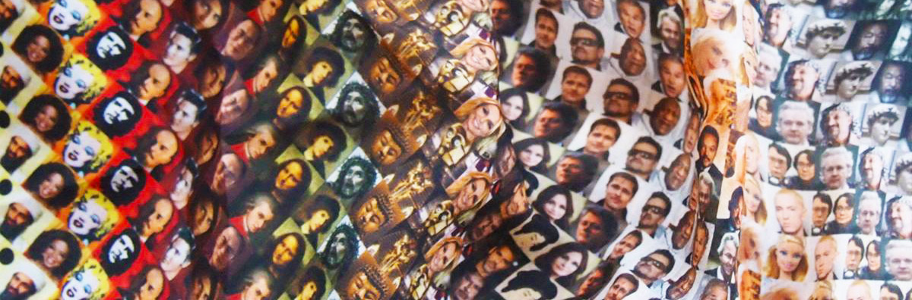

[](#)
# *Diagnostics of an Idol*

### Table of Contents
1. [Artefact](#Artefact)
    1. [Metadata](#Metadata)
2. [Research](#Research-h1)
3. [Transcoding](#Transcoding)
    1. [Transcoding No. 1](#Transcoding-no-1)
    2. [Transcoding Tools](#Transcoding-tools)
    3. [Transcoding No. 2](#Transcoding-no-2)
4. [Reflection](#Reflection)
5. [Outcome](#Outcome)
6. [Conclusion](#Conclusion)
7. [Bibliography](#Bibliography) 

# **Artefact**

Artist *Mieke Gerritzen* designed this textile piece, called Hero's Scarf, with a pattern created by the repetition of images of all possible modern icons of public figures, such as Mickey Mouse, Nelson Mandela, Marylin Monroe, but also mass murderers like Saddam Hussein, Osama BinLaden and Hitler. The eloquence of the scarf is precisely due to its extensive choice.

## **Metadata**
**Hero's Scarf**
| Tag | Data |  
|--|--|
**IISG Call Number** | [IISG BG P1/713](https://search.iisg.amsterdam/Record/1268178)
| **Physical Description** | Silk Scarf 
| **Type** | Object
| **Medium** | Textile
| **Materials** | Fabric/Silk
| **Date** | 2008
|| This silk scarf is 40x200 cm and fully printed with a colorful pattern created by the repetition of squared images (placed in a dense squared grid) of modern icons of public figures (factual and fictional) such as Madonna, Mickey Mouse, Jesus, Hitler, a burqua and Ilona Staller. 

# **Mieke and Stardom**

Mieke Gerritzen designed a scarf with the images of all possible modern icons of public figures, such as Mickey Mouse, Nelson Mandela, Marylin Monroe, but also mass murderers like Saddam Hussein, Osama BinLaden and Hitler. The eloquence of the scarf is precisely due to its extensive choice. This scarf was taken from the range on offer in the museum shop of the Stedelijk Museum in Amsterdam because visitors were offended by the presence of mass murderers on the scarf. Mieke Gerritzen discusses the position of 'controversial art' in a museum (shop). Apparently a museum shop is not a real part of the museum but a purely commercial institution. After a few days the scarf was offered for sale again.
Her work always revolves around exploring the relationship between images and various aspects of contemporary life. Mieke’s work is always thought-provoking and critical towards the way we devour images that are served to us every day of our lives. She often points out the paradox of the abundance of visual material on the one hand, and our illiteracy when it comes to really understanding what we see on the other hand.
> [...] "Yet the most characteristic quality of this new social development may not be the number of images that confronts us but rather our deep need to visualise everything we deem important. We do this en masse, even though most of us aren’t trained to do so."

***~~>> ICONOPHILIA/ICONOMANIA AND ICONOCLASM >>~~***

**This is the paradox of iconoclasm: it draws us to the very thing it would destroy, inscribing a story and creating an object that is, in certain respects, richer and more powerful than before.** <br> The toppled monument and the defaced statue strike us with greater force than their integral counterparts, becoming potential sites of reflection but also of emotional response.
There can be so much connected to this topic: the public perception of a "God", the maniac obsession of celebrities, that become icons (in a capitalistic society), the destruction of global heritage by an elite, the manipulation of information throughout time: the disappearing of some and the transformation of others.
Sacred damaged images acquire more symbolical value after the iconoclast intervention; other 'icons' simply disappear. 
The personal subjective perception of 'icons'? How do people see people and why? 
Think of this Heroes list's meaning in society, what is the response and what is the interpretation I want to give to it? Can I create my own Heroes' list? Or a list that would function in a utopian parallel universe?

*→ Can there be a shift in the meaning and reception of it? 
→ Can the obsession of these icons shift into a realisation of the loss of much more important things? (Native-American massacre should be much more important than Kim Kardashian) 
→ Can I address the superficiality/shallowness of people? 
→ Also, how do you define the importance of something? Because people give importance to it?
→ Can I relate it to memory?*

***~~>> STARDOM - HOLLYWOOD'S STARS <<~~***

Unquestionable role/life models of who we accept everything and even envy them → 
This is cause of the blindness of the majority of humanity.
In the 50's and 60's Stardom was blooming! Mostly because of Cinema Stars (also in Italy).
These people's personalities and lifestyles started to get all over tv and more and more visible. 
They were becoming what we now call "Icons"; their fashion style, their make up and hair, their habits (good but mostly bad) were so influential on average people that within no time they started to make more damage than ever. 
Stars started to wear furs and there started the boom of Fur Companies (which disintegrated the ethic principles of most people). 
Divorces became almost a habit and on a daily basis and easier for people to take that decision; devaluating love and respect.
Cigarettes were also a very "sexy" thing in movies, all the actors were smoking and this gave a boom to the tobacco industry: the number of smokers increased but also the healty issues that are a consequence;
Even Reality Shows, with their screaming and free violence (both phisical and psychological) created a layer of apathy and detachment and these ways of acting became ways of being, bringing violence up to a semi-normal level.
If One takes a VIP or star as a role/life model, copying everything they do and say, One loses the opportunity to discover and develop Oneself. One becomes a "stain" with no personality, losing connection with their own reality. One becomes a carbon copy of another. Using the single star as model, many become carbon copies. 
The majority of humanity grows in groups and gets labled for having very similar traits, interests, manners and habits. 
One major issues in idolizing these people is not really their habits or fashion: they all have one thing in common >> loads of money. 
The facts that the majority of Icons and Idols are all extremely rich puts a stress of the economical factor, making people think that money is the only thing that counts. Therefore money become a goal or purpose in someone's life, money becomes their drive, instead of other much more significant values. Money is a very shallow reason to do something or base something upon; and totally irrelevant when it comes to personal discovery or growth. 
By looking and copying there cannot be any personal and spiritual growth or development.

→ *But are all Icons bad?* 
The point is that it is the public that decides; when it comes to straight forward mass murderes or peace makes there is more or less an equal common response but when it comes to Stars there is more of a subtelty to it: it is a process, a long-term one. Mieke calls them "Heroes". What is a hero? It is very subjective: for some people Hitler is a hero and for others he is a murder. What if heroes do not exist? 

**~~>> QUESTIONS AND REFLECTIONS <<~~**

*→ North Korean study (ask Agata) 
→ The object is referential to the topic of Stardom
→ How does it open up venues when thinking in other media?
→ Research Why is it, that Archives prioritize content.
→ Mieke made it in her generation of Design Stars >> is it self preservation? **
→ Fame in relation to the face (how does recognition works), 
→ What is the resilience of someone's face? 
→ Who survives the process of recognition and why? 
→ Visual spamming? 
→ What is this object in relation to the Archive?
→ What is the urgency of the significance of it? 
→ What would it be if I had to update the scarf's content?
→ Its position in the archive can bring up many questions? Why is it there? 
→ Think of how to work with the Archive, how to traslate the "scarf" into a method or reason in how to work with the archive, think of materiality of it, why textile? Why a scarf?
→ Can I connect nostalgia to these icons?* 
*→ Think of the Criteria when classifying these people, who got chosen and who not?
→ List of actions to do when at the archive: tape, pictures, scan...(scent...)
→ Family tree (?) 
→ How do we make strategies for things to exist in a longer period of time ?
→ How is metadata of scarf collected and catalogued ? 
→ Create myhtology ?
→ Narratives, rituals...*
*→ Quiz, who is your hero? (given hero like a token)*

## Icons: in between **Original and Copy**

[](#)

*Example of Mieke's Design →* 

****The biggest visual power show****

→ 'To be heroes', why are heroes forced to *global visibility*? 
→ Why does Mieke chooses only fame related entrees? 
→ And why does she call them heroes and not 'icons'? 

→ Came across this video called *Versions* by Oliver Laric...


→*Link:*  [https://anthology.rhizome.org/versions](https://anthology.rhizome.org/versions) 

*Versions* is a meta-exploration of the relationship between copy and original, authorship, piracy, and reuse. Ultimately, *Versions* is a celebration of visual culture as a collective, social project, historically and in the internet-enabled present.

...which opened up doors to different approaches. 


> Touched with a hammer or a tunin fork, I cook every chant in my pot. It's the real thing.

> Many versions, are different perspectives, of one movable event.

> *Multiplications of an Icon, far from diluting its cultic power, rather increases its fame and each image - however imperfect -conventionally partakes of some portion of the properties of the pre-cursor.*

> Every lie creates a parallel world, the world in which is true.

**>> *KEYWORDS FOR POTENTIAL APPROACHES FOR TRANSCODING (INTERPRETATIVE) <<*
*How can I see these Icons? 
What could they turn into?***

**→ cult/power
→ pre-cursors
→ reproduction/copy/update
→ facial features/recognition
→ historical artifacts
→ rituals/myths**

→ Are 'heroes' and 'celebrities' distortions of reality? Re-edit into One's reality to fit their vision?
→ To which extent do humans project their needs, wishes and goals on other humans? Are humans aware of this projection? If so, how much are they concerned?
→ Where does the limit stands when idolizing? Is idolizing on a global scale fair?
→ Why is there such a bis reaction/opinion on this topic? 
→ How is metadata of scarf collected and catalogued ? 
→ How to approach the source/origin of this artifact?

**→ Fame in relation to the face = How does recognition works?** 

→ WHAT IS THE RESILIENCE OF SOMEONE'S FACE? 

- scientific approach (?)
- links to longevity of historical artifacts;
- compare a person's facial features to the effectivness of artifact's characteristics;
- related to media and reproduction: R*epetition and multiplication consolidates.*
    → CATEGORIZATION OF HEROES

    Mistification and mythification of human figures just like in ancient Greece and Rome, when it was mostly mythology that created heroes.

### **Distinctive features and Facial Recognition**


**→ Fame in relation to the face = How does recognition works?** 

It is helpful in approaching different methods of transcoding when it comes to interpretation and media. 

→ How does facial recognition work? ([https://www.nytimes.com/2019/07/10/opinion/facial-recognition-race.html](https://www.nytimes.com/2019/07/10/opinion/facial-recognition-race.html))


Mythology/Icons: Details/features that creates immediate recognition and when repeated/multiplied creates resistence in time. 

→ ***MULTIPLICATION CREATES ENDURANCE***

# **Transcoding**

Please include a general description of the role of transcoding in your project. Using the H2 headings below, you can specify individual Transcoding experiments. Think about your motivations in transcoding, and mention the role of tools (also those made during the assignment). This gives some direction to the reader about what they will read in more detail below.

## **Transcoding No. 1**

### **Updated Online Scarf**

I am recreating the scarf in a virtual/digital version, using a scraping tool to keep the pictures of the Icons updated (where possible) according to the current time. Some icons are fictional, archetypal or even object, so there will evolve together with the audience's posts. In the case of still-alive stars and icons, the pictures will 'grow' together with their originals. 

### **Methods**

Description of your methods, documentation of behind-the-scenes processes can go here. Think of the photos and videos you made when visiting the IISG or during captures of your artefact. You can use tools such as [Gifs.com](https://gifs.com/) to generate moving-image thumbnail to link to short videos.Just enough to give a clear overview, before getting into details.

With some HTML tags you can do simple styling in markdown, for example:

```
<width="50%">

```

[https://camo.githubusercontent.com/5c9cc2a6651a6a974d16632e91a3f5cb86326d35/68747470733a2f2f6a2e676966732e636f6d2f524f4a72337a2e676966](https://camo.githubusercontent.com/5c9cc2a6651a6a974d16632e91a3f5cb86326d35/68747470733a2f2f6a2e676966732e636f6d2f524f4a72337a2e676966)

Remember to include the url link to jump to the full media, of course!

### **Tools**

Html, ...

### **Results**

Some of your transcoding experiments may have smaller outcome sketches like images or short video tests. They can go directly within this section. Or maybe this transcoding became a part of the final outcome format. When that is the case, you can simply include a [hyperlink](https://github.com/IMD-Y3-2020/Example/blob/master/README.md#) to the final outcomes in the **Transcoding** section. In the final outcome section below you can embed or explain the final format outcome in detail.

## **Transcoding Tool**

### **Description**

You might have made multiple coding tools during the semester. Or the transcoding tool might be part of a specific transcoding experiment itself. It's up to you to define the linear flow of the Readme. Just like the transcoding of media itself, the coding tool should be well documented. So if you are using a coding tool in your first experiment, include the documentation of the coding tool **before** you include the results, etc.

### **Aims**

Include the main aims or intentions behind making the tool, and what it is used for.

### **Methods**

This includes the coding languages, coding frameworks or libraries, and any platforms or webtools for example.

### **Results**

The coding tool will vary a lot between different students. So depending on the use and type, you may include more or less documentation here.

### **Source Links**

Please include links to the tools, sources etc used during the coding. E.g. the resources used for making your coding tool.

# **Reflection**

You might want to include a section about reflecting on the results of your coding and IMD experiments this semester. It can give additional context before reading the final outcomes below.

# **Outcomes**

This section will be different for each student, depending on how and what is formatted as a final result for the semester assignment. Nevertheless a clear written and documented outcomes is important. So give the appropriate subsections or formats to make this as thorough as possible.

### **Outcome Links**

Here you link to your final assignment outcomes. This could be a website, a video, etc etc. Please include links to the appropriate GitHub folder on your repository where your coding tool is stored.

This is the main way to access your IMD + Coding outcomes for the semester. So its very important that you check for bugs, troubleshoot hyperlink issues, embedded media issues etc. Please make sure you KNOW where each file you use is stored. E.g. If you migrated from Notion markdown into GitHub, its **VERY IMPORTANT** to know that Notion randomly stores images on an Amazon server. It changes those locations all the time. So if your main outcome or documentation is still grabbing those links, **its very likely** they might disappear before collectives. So please have all media and necessary files managed well in your own locations (online or github etc).

# **Conclusion**

You might have a nice conclusive observation to share at the end :)

## **Bibliography**

Of course, as with all research work please include a good bibliography with links, and any references that were used or might give additional depth to the work.

**[1]**: Look at this little referenced footnote over here. You can look up different text formats for referencing books, online articles, films etc.
